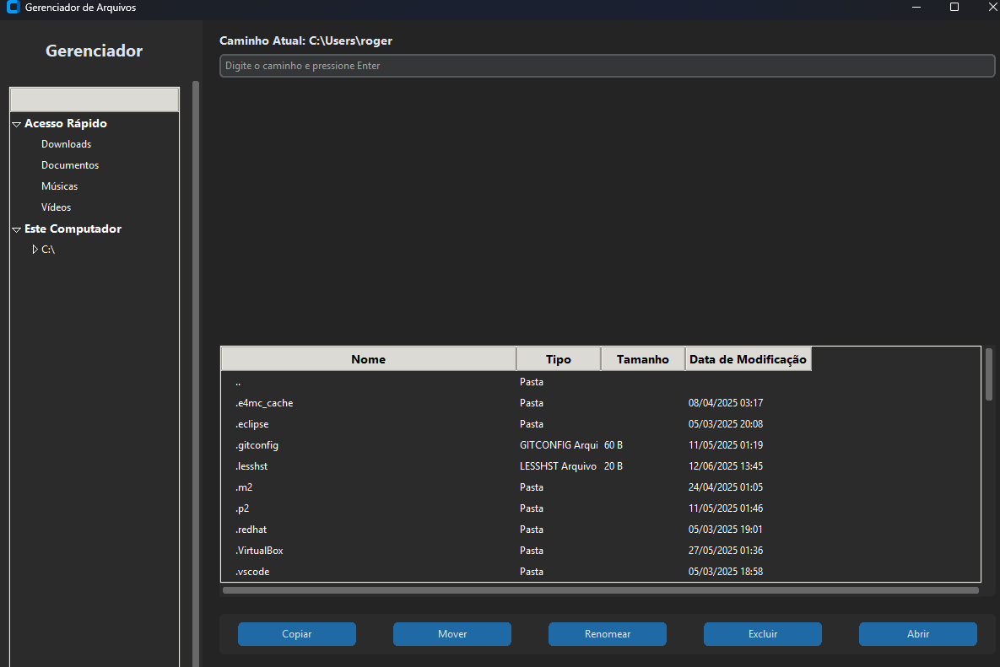

# 📁 Gerenciador de Arquivos com Interface Moderna em Python


Um gerenciador de arquivos completo com interface gráfica moderna e intuitiva, desenvolvido em Python usando a biblioteca [CustomTkinter](https://github.com/TomSchimansky/CustomTkinter). Com ele, você pode explorar diretórios, copiar, mover, renomear, excluir e até abrir arquivos facilmente.

---

## ✨ Funcionalidades

✅ Interface gráfica escura e moderna  
✅ Navegação por diretórios e unidades (HD, SSD, pendrive etc.)  
✅ Acesso rápido a pastas comuns como **Downloads**, **Documentos**, **Imagens**  
✅ Lista com detalhes: nome, tipo, tamanho, data de modificação  
✅ Campo para digitar manualmente o caminho  
✅ Ações: Copiar, Mover, Renomear, Excluir e Abrir  
✅ Sistema de logs automáticos para acompanhar ações  
✅ Totalmente feito com Python

---

## 🖼️ Captura de Tela



---

## 🛠️ Tecnologias e Bibliotecas

- [Python 3.10+](https://www.python.org/)
- [CustomTkinter](https://github.com/TomSchimansky/CustomTkinter)
- `tkinter` (padrão do Python)
- `psutil` (para detectar discos e partições)

---

## 🚀 Como Executar

### 1. Clone o repositório:
```bash
git clone https://github.com/RogerOliveira1/Gerenciador-de-arquivos-python.git
cd Gerenciador-de-arquivos-python
```

### 2. Instale as dependências:
```bash
pip install -r requirements.txt
```

### 3. Execute a aplicação:
```bash
python main.py
```

---

## 📂 Estrutura de Pastas

```
Gerenciador-de-arquivos-python/
├── main.py                     # Arquivo principal que inicia o app
├── requirements.txt            # Dependências do projeto
├── frontend/
│   └── gui.py                  # Interface gráfica
├── backend/
│   ├── file_operations.py      # Lógica de copiar, mover, renomear, excluir
│   ├── drive_detector.py       # Detecção de discos e unidades
│   └── logger.py               # Sistema de logs
└── docs/
    └── screenshot.png          # Imagem de demonstração
```

---

## 🙋‍♂️ Autor

**Roger Oliveira**
**Eduardo Drozdz**
**Leandro**  
🔗 [GitHub](https://github.com/RogerOliveira1)

---

## 📃 Licença

Este projeto está sob a licença MIT. Veja o arquivo [LICENSE](LICENSE) para mais detalhes.

---

## ⭐ Contribua

Sinta-se à vontade para dar um ⭐ se este projeto te ajudou, ou envie um pull request para contribuir!
